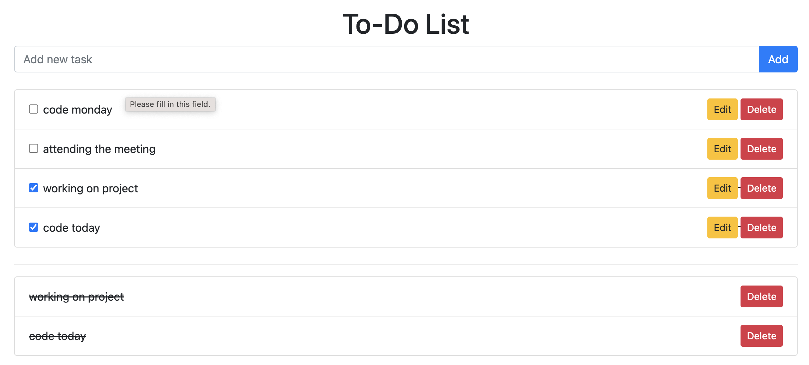

# To-Do application
## setup instructions
1 repository:
'''bash
 https://github.com/leokadiaCharles/toe-do-app.git

 2 install dependencies:
 composer install

 3 create copy of the '.env'file:
  cp .env.example .env

  4 configure the '.env' file to connect to your database.
  
  5 run migration:
  php run migrate

  6 serve the application:
  php artisan serve

  7 open your brouser and visit
  'http://127.0.0.1:8000'.

  functionality
  .add new task
  .delete task
  .update task
  .mark as completed
  

  technologies:
  laravel

  ## user interface

  

  